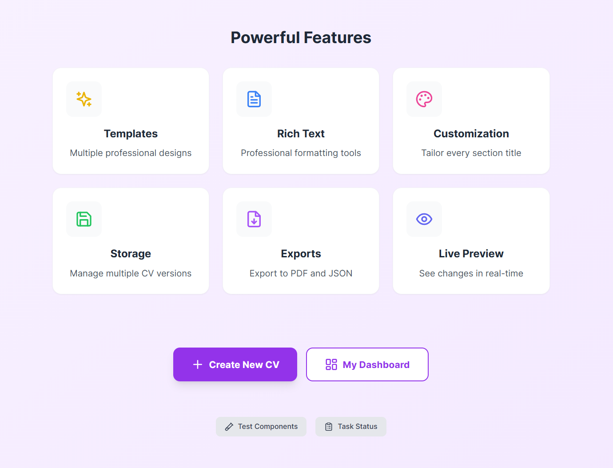
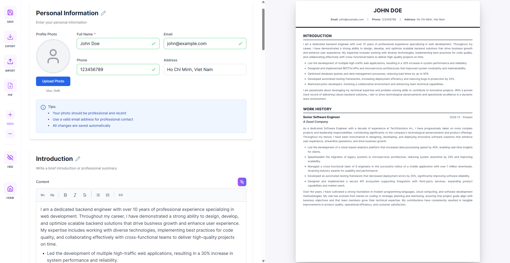
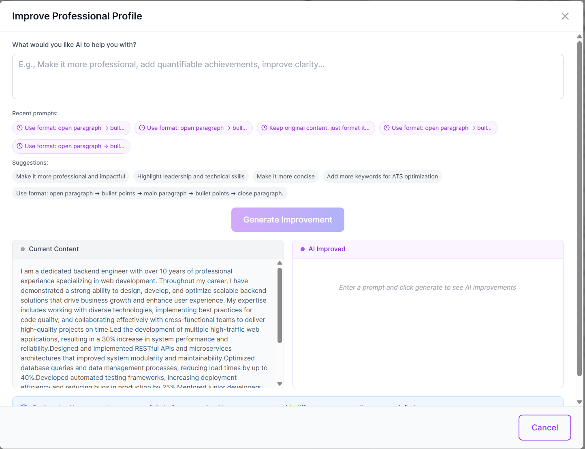

# Power CV

A modern CV/Resume builder powered by AI assistance, enabling users to create professional resumes with intelligent suggestions and real-time editing.

## Preview

### Home Dashboard


### CV Editor


### AI-Powered Support


## System Requirements

- Docker Engine 20.10+
- Docker Compose 2.0+
- 4GB RAM minimum
- 2GB free disk space

## Quick Start

### Environment Setup

AI features require an OpenAI API key. Create a `.env` file in the `client` directory:

```bash
VITE_OPENAI_API_KEY=your_openai_api_key_here
```

### Production Mode

```bash
# Start all services
docker-compose up -d

# Access the application
# Frontend: http://localhost:5173
# Backend API: http://localhost:5001
# pgAdmin: http://localhost:5050
```

### Development Mode

```bash
# Start with development configuration
docker-compose -f docker-compose.dev.yml up -d

# View logs
docker-compose logs -f
```

### Stop Services

```bash
docker-compose down

# Remove volumes (database data)
docker-compose down -v
```

## Services

| Service | Port | Description |
|---------|------|-------------|
| Client | 5173 | React frontend application |
| Server | 5001 | Node.js backend API |
| PostgreSQL | 5432 | Database |
| pgAdmin | 5050 | Database management (optional) |

## Tech Stack

- **Frontend**: React + TypeScript + Vite + Tailwind CSS
- **Backend**: Node.js + Express + Prisma ORM
- **Database**: PostgreSQL 16
- **State Management**: Zustand
- **Package Manager**: pnpm

## License

MIT